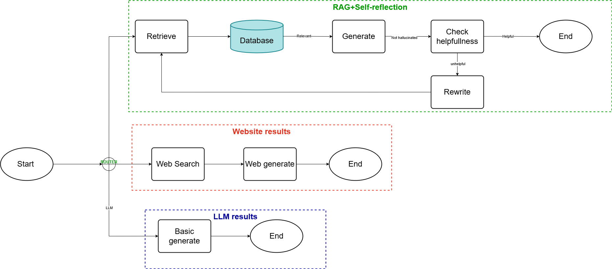

# STAR-RAG
STAR-RAG is a university-focused question answering system designed to provide accurate, reliable, and context-aware responses to both institutional and open-domain queries. Traditional search tools and large language models (LLMs) struggle with fragmented university information and frequently hallucinate when relevant data is unavailable. STAR-RAG addresses these limitations by combining local document retrieval with LLM reasoning and a self-reflection mechanism that verifies and improves generated answers.

The system dynamically routes user queries to one of three paths: a retrieval-augmented generation pipeline for university-specific questions, a lightweight LLM-only response for simple queries, or a web search module for external information. By grounding responses in authoritative institutional documents and applying self-reflection to reduce hallucinations, STAR-RAG delivers more trustworthy answers while maintaining general-purpose usability.

This project is implemented using LangGraph, LangChain, and transformer-based embedding models, and demonstrates improved accuracy, reduced hallucinations, and higher user satisfaction compared to baseline LLM systems.

## System Architecture

